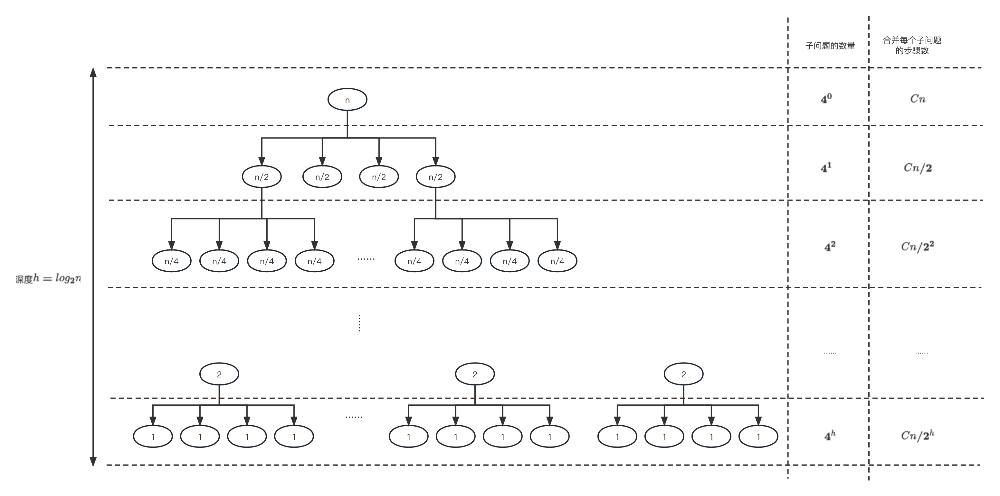

# 分治法 Divide-and-conquer algorithms

当我们要设计一套算法去解决问题时，会有一些常见的算法策略帮助我们设计思路，比如贪心算法、分治法、动态规划等。在实际应用中，我们会根据问题场景的特点来选择不同的策略。这篇文章将会讲解分治法，当问题可以分解为多个相互独立的小问题时，我们可以使用这个策略。

通常分治法会通过以下3个步骤来解决问题：
1. 将问题分解成与原问题类型相似、相互独立的子问题，子问题又可以通过相同的方式分解成更小的子问题。通过递归的方式，将问题分解到足够小，小到每个子问题可以直接求解。
2. 解决每个子问题。
3. 将子问题的解合并成父问题的解，接着再进一步合并到最大问题的解。

使用分治法思想最典型的例子之一就是归并排序（merge sort）.

## 分治法与时间复杂度

**分治法最关键的步骤就是上述的第一步，这个步骤设计得好，算法的时间复杂度会有大的优化**。我们通过下面这个例子感受分治法和时间复杂度的关系。

### 整数相乘

在这个例子里，我们的目标是计算2个n位整数相乘的结果。当n比较大的时候，一般计算机的CPU是难以通过1个指令直接计算出结果的，因此我们需要将大的整数相乘分为若干个小的整数相乘，而小的整数相乘又可以进一步分为若干个更小的整数相乘，直到CPU可以直接计算为止。最后我们将若干个小的整数相乘的计算结果进行结合，就能获取到最后想要的结果。

具体步骤如下。

假设我们有两个输入分别是x和y，它们都是n位的整数。首先我们会将每个整数分为左右两半，分别以下标L和下标R表示。这样x和y可以以下面这个公式表示（为了方便计算，我们假设n为2的幂，也就是说$2^x = n$）：
$$
x = 2^{n/2}x_L + x_R \\ y = 2^{n/2}y_L + y_R
$$

假设$x=10110110_2$（下标2表示这个数是以二进制表示），那么$x_L=1011_2$，$x_R=0110_2$。

那么x和y相乘可以被描述为
$$ xy = (2^{n/2}x_L + x_R)(2^{n/2}y_L + y_R) = 2^nx_Ly_L + 2^{n/2}(x_Ly_R + x_Ry_L) + x_Ry_R $$

在这个公式里，我们可以看到分治法的思想。我们把n位整数相乘$xy$**分解为4个n/2位整数相乘**，分别是$x_Ly_L$、$x_Ly_R$、$x_Ry_L$和$x_Ry_R$。我们可以将这4个相乘以同样的方式继续分解下去，直到计算机能够轻易计算为止。这就是上述分治法的第一步：

> 1. 将问题分解成类型与原问题相似、相互独立的子问题，子问题又可以通过相同的方式分解成更小的子问题。通过递归的方式，将问题分解到足够小，小到每个子问题可以直接求解。

当我们计算完4个n/2位整数相乘的结果后，我们要做的就是合并这些结果。从公式中我们可以知道，这一过程主要有两个步骤。第1步是将结果乘以$2^n$或者$2^{n/2}$，实际上就是让2进制数往右移$n$位或${n/2}$位，很容易解决。第2步就是将结果进行相加。总的来说，合并过程的时间复杂度约为$Cn$，其中$C$为常量。这就是上述分治法度第三步：

> 3. 将子问题的解合并成父问题的解，接着再进一步合并到最大问题的解。

我们将上述计算2个n位整数相乘过程的时间复杂度表示为$T(n)$，那么我们得到
$$ T(n) = 4T(n/2) + Cn \\
T(1) = 1
$$

假设我们将子问题递归到$n=1$为止，那么整个递归过程如下：

因此我们可以得到
$$ 
\begin{align}
T(n)  &= 4^0 \times Cn + 4^1 \times Cn/2 + 4^3 \times Cn/4 + ... + 4^h \times Cn/2^h 
\\ &= Cn[4^0/2^0 + 4^1/2^1 + 4^2/2^2 + ... + 4^h/2^h]
\\ &= Cn[2^0 + 2^1 + 2^2 + ... + 2^h]
\\ &= Cn[2^{h+1} - 1]
\\ &= Cn[2n - 1]
\\ &= O(n^2)
\end{align}
$$
总的时间复杂度为$O(n^2)$

### 优化整数相乘
上述算法的时间复杂度是$O(n^2)$，其实还可以进一步优化，那如何优化呢？上文已经提到过，分治法最关键的一步就是第一步：
> 1. 将问题分解成与原问题类型相似、相互独立的子问题，子问题又可以通过相同的方式分解成更小的子问题。通过递归的方式，将问题分解到足够小，小到每个子问题可以直接求解。

我们可以思考优化下方的公式，以降低算法的时间复杂度。
> $$ xy = (2^{n/2}x_L + x_R)(2^{n/2}y_L + y_R) = 2^nx_Ly_L + 2^{n/2}(x_Ly_R + x_Ry_L) + x_Ry_R $$

数学家[高斯](https://en.wikipedia.org/wiki/Carl_Friedrich_Gauss)曾发现两个虚数相乘
$$
  (a+bi)(c+di)=ac-bd+(bc+ad)i
$$
看起来需要进行4次乘法运算（ac、bd、bc和ad），但其实只需3次就行，因为
$$
  bc+ad=(a+b)(c+d)-ac-bd
$$

因此将这个发现结合上述整数相乘的公式，我们可以把公式优化为

$$
\begin{align}
xy &= (2^{n/2}x_L + x_R)(2^{n/2}y_L + y_R) 
\\ &= 2^nx_Ly_L + 2^{n/2}(x_Ly_R + x_Ry_L) + x_Ry_R
\\ &= 2^nx_Ly_L + 2^{n/2}[(x_R + x_L)(y_R + y_L) - x_Ry_R - x_Ly_L] + x_Ry_R
\end{align}
$$

因此我们把n位整数相乘从上述的分解为4个n/2位整数相乘**优化到为3个**，分别是$x_Ly_L$、$x_Ry_R$和$(x_R + x_L)(y_R + y_L)$。
从而时间复杂度为
\[
\begin{align}
T(n) &= 3T(n/2) + Cn
  \\ &= O(n^{1.59})
\end{align}
\]

## 主定理 Master Theorem

## 分治法的其他应用
